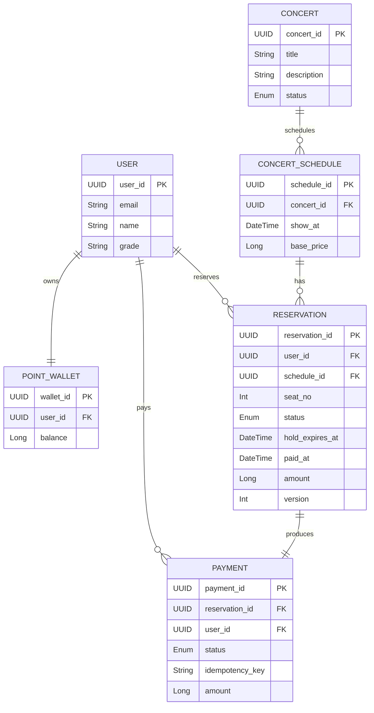

# 🎫 Concert Reservation Service – ERD

---

## ✅ Domain Entities

```
User
Concert
ConcertSchedule
Reservation
Payment
PointWallet
QueueToken (Redis)
```

---

## 📦 Entity Definitions

---

### USER

> 로그인 기능 연동을 위해 `email` 포함

| Field | Type | Description |
|------|------|--------------|
| user_id (PK) | UUID | 사용자 ID |
| email (UNIQUE) | String | 로그인 이메일 |
| name | String | 사용자 이름 |
| grade | String | 사용자 등급 |
| created_at | DateTime | 생성 |
| updated_at | DateTime | 수정 |

---

### POINT_WALLET

| Field | Type | Description |
|------|------|--------------|
| wallet_id (PK) | UUID | 월렛 ID |
| user_id (FK, UNIQUE) | UUID | 사용자 ID |
| balance | Long | 잔액 |
| created_at | DateTime | 생성 |
| updated_at | DateTime | 수정 |

---

### CONCERT

| Field | Type | Description |
|------|------|--------------|
| concert_id (PK) | UUID | 콘서트 ID |
| title | String | 콘서트 제목 |
| description | String | 설명 |
| status | Enum (OPEN, CLOSED) | 공연 상태 |
| created_at | DateTime | 생성 |
| updated_at | DateTime | 수정 |

---

### CONCERT_SCHEDULE

| Field | Type | Description |
|------|------|--------------|
| schedule_id (PK) | UUID | 회차 ID |
| concert_id (FK) | UUID | 콘서트 |
| show_at | DateTime | 공연 시각 |
| base_price | Long | 기준 가격 |
| created_at | DateTime | 생성 |
| updated_at | DateTime | 수정 |

---

### RESERVATION

**Status**
```
HELD, CONFIRMED, CANCELED, EXPIRED
```

| Field | Type | Description |
|------|------|--------------|
| reservation_id (PK) | UUID | 예약 ID |
| user_id (FK) | UUID | 사용자 |
| schedule_id (FK) | UUID | 회차 |
| seat_no | Int | 좌석 번호 |
| status | Enum | 예약 상태 |
| hold_expires_at | DateTime | 홀드 만료 |
| paid_at | DateTime | 결제 완료 |
| amount | Long | 예약 금액 |
| version | Int | Optimistic Lock |
| created_at | DateTime | 생성 |
| updated_at | DateTime | 수정 |

**Seat Active Unique**
```sql
UNIQUE (schedule_id, seat_no)
WHERE status IN ('HELD','CONFIRMED');
```

---

### PAYMENT

**Status**
```
CREATED, SUCCESS, FAILED, CANCELED
```

| Field | Type | Description |
|------|------|--------------|
| payment_id (PK) | UUID | 결제 ID |
| reservation_id (FK, UNIQUE) | UUID | 예약 |
| user_id (FK) | UUID | 사용자 |
| status | Enum | 결제 상태 |
| idempotency_key | String | 멱등 키 |
| amount | Long | 결제 금액 |
| created_at | DateTime | 생성 |
| paid_at | DateTime | 결제 완료 |

**Idempotency**
```sql
UNIQUE (user_id, idempotency_key);
```

---

### QUEUE_TOKEN (Redis)

> DB 저장 대상 아님 (TTL 상태관리)

**Structure**

```json
{
  "token": "string",
  "position": 12,
  "status": "WAITING | ACTIVE | EXPIRED",
  "expires_at": "datetime"
}
```

---

## 🔗 Relationships

| Relationship |
|----------------|
| USER 1 ─ 1 POINT_WALLET |
| USER 1 ─ N RESERVATION |
| USER 1 ─ N PAYMENT |
| CONCERT 1 ─ N CONCERT_SCHEDULE |
| CONCERT_SCHEDULE 1 ─ N RESERVATION |
| RESERVATION 1 ─ 1 PAYMENT |

---

## 📊 ERD



---
