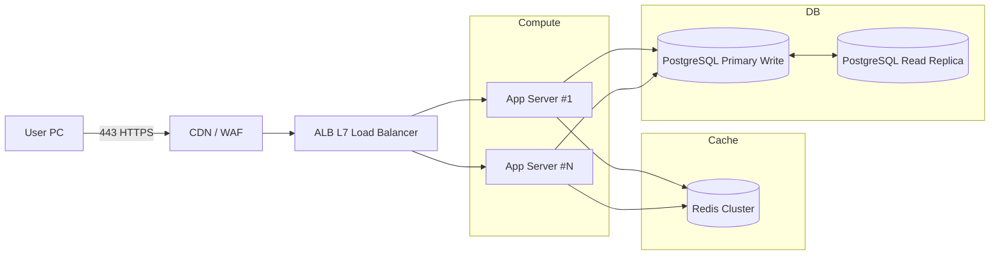
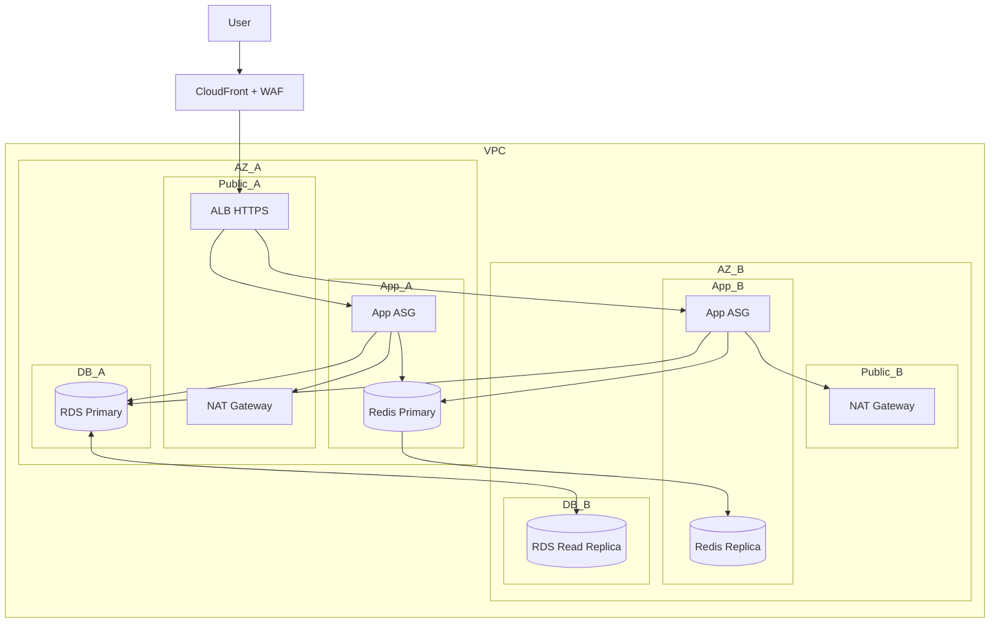

# ☁ Infra 구성도 - Concert Reservation Service

콘서트 예약 서비스의 대규모 동시 접속 환경에서  
좌석 선점 경쟁 및 대기열 처리를 안정적으로 수행하기 위한 인프라 아키텍처 구성도이다.

---

## 1) High-Level Architecture

---

## 2) Multi-AZ Deployment (AWS VPC)

---

## 3) Network & Security

### WAF / Load Balancer

- **WAF + CloudFront**
    - L7 DDoS 차단
    - HTTPS 종단
    - Edge 캐싱

- **ALB**
    - API 요청 분산
    - 무상태 서버 헬스 체크

---

### Security Group 정책

| Source | Target | Port |
|--------|--------|------|
| ALB SG | App SG | 443 / 80 |
| App SG | Redis SG | 6379 |
| App SG | RDS SG | 5432 |
| App SG | Internet | NAT 통해 허용 |

---

### Secrets

- AWS Secrets Manager
- SSM Parameter Store

---

## 4) 운영 전략

---

### Scaling

- ALB 기반 수평 확장
- App ASG CPU/QPS 기반 Auto Scaling

---

### Data Availability

- PostgreSQL Primary + Read Replica
- Redis Primary / Replica 구성

---

### Backup

- RDS 자동 백업
- Redis Snapshot

---

### Observability

- CloudWatch Metrics/Logs
- OpenTelemetry 기반 분산 추적

---

## 5) Component Roles

| Component | Responsibility |
|----------|----------------|
| CDN/WAF | Edge 보안, 캐시 |
| ALB | L7 트래픽 분산 |
| App Servers | API 처리 |
| Redis Cluster | Queue Token, Seat Lock, TTL |
| PostgreSQL | Reservation, Payment, Wallet 영속성 |

